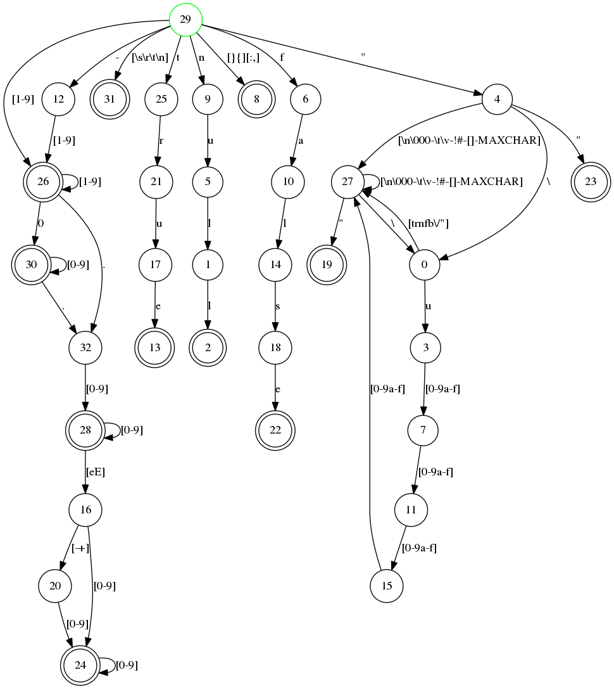

# 2. コンパイラ

この本ではプログラミング言語Erlangは扱いませんが、ERTSのゴールはErlangコードを実行することなので、Erlangコードのコンパイル方法を知っている必要があります。この章では読みやすいビームコードを生成するために必要なコンパイラのオプションと、生成されたビームファイルにデバッグ情報を追加する方法について説明します。この章の終わりにはElixirコンパイラについてのセクションもあります。

自分の好きな言語をERTSにコンパイルすることに興味がある読者のために、この章ではコンパイラのさまざまな中間フォーマットや、あなたのコンパイラをbeamコンパイラバックエンドにプラグインする方法についての詳細情報も提供します。また、構文解析変換を紹介し、それを使ってErlang言語を調整する方法の例も挙げます。

## 2.1. Erlangのコンパイル

Erlangは.erlファイルにあるソースコードモジュールからファットバイナリの.beamファイルにコンパイルされます。

コンパイラはOSのシェルからerlcコマンドで実行することができます。

```
> erlc foo.erl
```

あるいは、コンパイラはErlangシェルからデフォルトのシェルコマンド c を使って起動することもできますし、 compile:file/{1,2} を呼び出して起動することもできます。

```
1> c(foo).
```

または、

```
1> compile:file(foo).
```

compile:file のオプションの第二引数は、コンパイラのオプションのリストです。オプションの完全なリストは compile モジュールのドキュメントにあります: http://www.erlang.org/doc/man/compile.html を参照してください。

通常、コンパイラはErlangのソースコードを.erlファイルからコンパイルして、結果のバイナリビームコードを.beamファイルに書き出します。コンパイラにbinaryオプションを与えることで、結果のバイナリをErlangの項として返すこともできます。このオプションはオーバーロードされ、ファイルに書き込む代わりに任意の中間フォーマットを項として返すようになりました。例えば、コンパイラにCore Erlangコードを返させたい場合は、[core, binary]というオプションを指定します。

コンパイラは、図6に示すように、いくつかのパスから構成されている。

Figure 6. Compiler Passes 

もしコンパイラパスの完全で最新のリストを見たいなら、Erlangシェルでcompile:options/0という関数を実行することができます。コンパイラに関する情報の決定的なソースはもちろんソースです： compile.erl

## 2.2. 中間出力の生成

コンパイラが生成するコードを見ることは、仮想マシンがどのように動作するかを理解しようとする上で大きな助けになる。幸いなことに、コンパイラは各コンパイラパスの後の中間コードと最終的なビームコードを見せてくれる。

生成されたコードを見て、新しく得た知識を試してみましょう。

```
 1> compile:options().
 dpp - Generate .pp file
 'P' - Generate .P source listing file
 
 ...

 'E' - Generate .E source listing file

 ...

 'S' - Generate .S file
```

小さな例題プログラム "world.erl "で試してみましょう。

```
-module(world).
-export([hello/0]).

-include("world.hrl").

hello() -> ?GREETING.
```

そして、インクルードファイル "world.hrl"

```
-define(GREETING, "hello world").
```

ここで、解析されたファイルを得るために「P」オプションをつけてコンパイルすると、「world.P」というファイルが得られます。

```
2> c(world, ['P']).
** Warning: No object file created - nothing loaded **
ok
```

出来上がった.Pファイルには、プリプロセッサ（とパース変換）が適用された後のコードがきれいに印刷されているのが見えます。

```
-file("world.erl", 1).

-module(world).

-export([hello/0]).

-file("world.hrl", 1).

-file("world.erl", 4).

hello() ->
    "hello world".
```

すべてのソースコードの変換が終わった後のコードの様子を見るには、'E'フラグを付けてコンパイルするとよいでしょう。

```
3> c(world, ['E']).
** Warning: No object file created - nothing loaded **
ok
```

この場合、すべてのコンパイラディレクティブが削除され、ビルトイン関数 module_info/{1,2} がソースに追加されています。

```
-vsn("\002").

-file("world.erl", 1).

-file("world.hrl", 1).

-file("world.erl", 5).

hello() ->
    "hello world".

module_info() ->
    erlang:get_module_info(world).

module_info(X) ->
    erlang:get_module_info(world, X).
```

P' と 'E' オプションはセクション2.3.2で解析変換を見るときに使いますが、まずは生成されたBEAMコードの "アセンブラ" ビューを見ましょう。コンパイラにオプション 'S' を与えると、コード内の各BEAM命令に対応するErlang用語を含む .S ファイルが得られます。

```
3> c(world, ['S']).
** Warning: No object file created - nothing loaded **
ok
```

ファイルworld.Sはこのようになっているはずです。

```
{module, world}.  %% version = 0

{exports, [{hello,0},{module_info,0},{module_info,1}]}.

{attributes, []}.

{labels, 7}.


{function, hello, 0, 2}.
  {label,1}.
    {line,[{location,"world.erl",6}]}.
    {func_info,{atom,world},{atom,hello},0}.
  {label,2}.
    {move,{literal,"hello world"},{x,0}}.
    return.


{function, module_info, 0, 4}.
  {label,3}.
    {line,[]}.
    {func_info,{atom,world},{atom,module_info},0}.
  {label,4}.
    {move,{atom,world},{x,0}}.
    {line,[]}.
    {call_ext_only,1,{extfunc,erlang,get_module_info,1}}.


{function, module_info, 1, 6}.
  {label,5}.
    {line,[]}.
    {func_info,{atom,world},{atom,module_info},1}.
  {label,6}.
    {move,{x,0},{x,1}}.
    {move,{atom,world},{x,0}}.
    {line,[]}.
    {call_ext_only,2,{extfunc,erlang,get_module_info,2}}.
```

これはドット(".")で区切られたErlang用語のファイルなので、Erlangシェルにファイルを読み戻すには次のようにします。

```
{ok, BEAM_Code} = file:consult("world.S").
```

アセンブラコードは、ほとんど元のソースコードのレイアウトに従います。

最初の命令でコードのモジュール名を定義する。コメントで述べられているバージョン（%% version = 0）は、ビームオペコードフォーマットのバージョン（beam_opcodes:format_number/0で与えられるもの）である。

そして、Erlangのソースモジュールと同じように、エクスポートのリストとコンパイラの属性（この例ではなし）が来ます。

この命令は、コード中のラベルの数をVMに伝え、1回のコード処理ですべてのラベルのための領域を確保できるようにするものです。

その後に、各関数の実際のコードがあります。最初の命令では、関数名、アリティ、エントリポイントをラベル番号で指定します。

S' オプションはBEAMがどのように動作するかを理解するのに非常に効果的に使うことができますし、後の章でもそのように使っていきます。また、もしあなたが自分の言語を開発して、Core Erlangを通してBEAMにコンパイルし、生成されたコードを見ることができれば、それはとても貴重なことです。

## 2.3. コンパイラーパス

以下のセクションでは、図6に示されたコンパイラパスのほとんどについて説明します。BEAMをターゲットとする言語設計者にとってこれは興味深いものです。マクロ、パース変換、コアerlang、BEAMコードという異なるアプローチで何ができるのか、そしてそれらがどのように互いに依存しているのかを示すことになるからです。

Erlangのコードをチューニングするときに、どのような最適化がいつ行われるのか、そして最適化の前と後の生成されたコードをどのように見ることができるのかを知っておくとよいでしょう。

### 2.3.1. コンパイラパス。Erlangプリプロセッサー (epp)

コンパイルは、トークン化器（またはスキャナ）とプリプロセッサを組み合わせたものから始まります。つまり、プリプロセッサがトークナイザを駆動します。これはマクロがトークンとして展開されることを意味し、（例えばm4やcppのような）純粋な文字列置換ではありません。Erlangのマクロを使って独自の構文を定義することはできません。マクロは周囲の文字とは別のトークンとして展開されます。マクロと文字を1つのトークンに連結することはできません。

```
-define(plus,+).
t(A,B) -> A?plus+B.
```

に拡大する予定です。

```
t(A,B) -> A + + B.
```

でなく

```
t(A,B) -> A ++ B.
```

一方、マクロの展開はトークンレベルで行われるので、マクロの右側に有効なErlang用語がなくても、有効な用語を与えるような使い方をすればいいのです。例

```
-define(p,o, o]).
 t() -> [f,?p.
```

難読化されたErlangコードのコンテストで優勝すること以外に、これを実際に使うことはほとんどありません。覚えておいてほしいのは、Erlangプリプロセッサを使ってErlangとは異なるシンタックスを持つ言語を定義することはできないということです。幸い、後で見るように、これを行うには他の方法があります。

### 2.3.2. コンパイラパス。パース変換

Erlang言語をいじる一番簡単な方法はParse Transformations（またはParse Transforms）を使うことです。Parse TransformにはOTPのドキュメントにあるこの注意書きのような、いろんな警告があります。

```
プログラマーは解析変換を行わないよう強くお勧めします。また、問題が発生した場合のサポートも行いません。
```

解析変換を使用すると、基本的にコンパイラに余分なパスを書くことになり、注意しないと非常に予期しない結果につながる可能性があります。しかし、解析変換を使用するには、それを使用するモジュールで使用法を宣言する必要があり、それはそのモジュールに局所的になります。したがって、コンパイラの調整という点では、この方法は非常に安全です。

私が考える構文解析変換の最大の問題は、あなた自身の構文を発明していることであり、あなたのコードを読む他の人にとってより困難になるということです。少なくとも、あなたの解析変換が、例えばQLCのように一般的に広く使われるようになるまでは、です。

さて、それでは使ってはいけないとわかっていても、使わなければならない場合は、以下のことを知る必要があります。構文解析変換は、抽象構文木（AST）上で動作する関数です（http://www.erlang.org/doc/apps/erts/absform.html を参照）。コンパイラは前処理、トークン化、構文解析を行い、AST を使ってパース変換関数を呼び出し、新しい AST が返ってくることを期待します。

これはErlangの構文を根本的に変えることはできないが、セマンティクスは変えられるということです。例えば、何らかの理由でErlangのコードの中に直接jsonコードを書きたいとしましょう。また、Erlangコンパイラはほとんどのサニティチェックをパース変換の後のリンターパスで行うので、有効なErlangを表現していないASTを許すことができます。

解析変換を書くには、関数parse_transform/2をエクスポートするErlangモジュール（pと呼びましょう）を書く必要があります。 この関数はコンパイルされるモジュール（mと呼びましょう）がコンパイラオプション {parse_transform, p} を含んでいれば、解析変換の時にコンパイラによって呼び出されます。この関数の引数は、モジュール m の AST と、コンパイラの呼び出し時に指定されたコンパイラオプションです。

```
ファイル内で指定されたコンパイラオプションは取得されないことに注意してください。これは、コードから解析変換にオプションを与えることができないため、少し厄介です。

コンパイラは、パース変換パスの後に発生する展開パスまで、コンパイラオプションを展開しません。
```

抽象フォーマットのドキュメントはやや密度が高く、ドキュメントを読んで抽象フォーマットを把握するのはかなり困難です。ASTの本格的な作業には、syntax_toolsや特にerl_syntax_libを使うことをお勧めします。

ここでは、ASTを理解するために簡単な構文解析変換を開発します。そのため、ASTを直接操作し、syntax_toolsの代わりに昔から信頼されているio:formatのアプローチを使用することになります。

まず、json_test.erlをコンパイルできるようにするためのサンプルを作成します。

```
-module(json_test).
-compile({parse_transform, json_parser}).
-export([test/1]).

test(V) ->
    <<{{
      "name"  : "Jack (\"Bee\") Nimble",
      "format": {
                 "type"      : "rect",
                 "widths"     : [1920,1600],
                 "height"    : (-1080),
                 "interlace" : false,
                 "frame rate": V
                }
      }}>>.
```

次に、最小限のパース変換モジュールjson_parser.erlを作成します。

```
-module(json_parser).
-export([parse_transform/2]).

parse_transform(AST, _Options) ->
  io:format("~p~n", [AST]),
  AST.
```

このIDパース変換は、変更されていないASTを返しますが、ASTがどのようなものかを確認できるように、それをプリントアウトすることもできます。

```
> c(json_parser).
{ok,json_parser}
2> c(json_test).
[{attribute,1,file,{"./json_test.erl",1}},
 {attribute,1,module,json_test},
 {attribute,3,export,[{test,1}]},
 {function,5,test,1,
  [{clause,5,
    [{var,5,'V'}],
    [],
    [{bin,6,
      [{bin_element,6,
        {tuple,6,
         [{tuple,6,
           [{remote,7,{string,7,"name"},{string,7,"Jack (\"Bee\") Nimble"}},
            {remote,8,
             {string,8,"format"},
             {tuple,8,
              [{remote,9,{string,9,"type"},{string,9,"rect"}},
               {remote,10,
                {string,10,"widths"},
                {cons,10,
                 {integer,10,1920},
                 {cons,10,{integer,10,1600},{nil,10}}}},
               {remote,11,{string,11,"height"},{op,11,'-',{integer,11,1080}}},
               {remote,12,{string,12,"interlace"},{atom,12,false}},
               {remote,13,{string,13,"frame rate"},{var,13,'V'}}]}}]}]},
        default,default}]}]}]},
 {eof,16}]
./json_test.erl:7: illegal expression
./json_test.erl:8: illegal expression
./json_test.erl:5: Warning: variable 'V' is unused
error
```

モジュールは無効なErlang構文を含んでいるので、json_testのコンパイルは失敗しますが、ASTがどのようなものかを見ることができます。あとはASTをトラバースして、jsonのコードをErlangのコードに書き換える関数を書けばいいのです[1]。

```
-module(json_parser).
-export([parse_transform/2]).

parse_transform(AST, _Options) ->
    json(AST, []).

-define(FUNCTION(Clauses), {function, Label, Name, Arity, Clauses}).

%% We are only interested in code inside functions.
json([?FUNCTION(Clauses) | Elements], Res) ->
    json(Elements, [?FUNCTION(json_clauses(Clauses)) | Res]);
json([Other|Elements], Res) -> json(Elements, [Other | Res]);
json([], Res) -> lists:reverse(Res).

%% We are interested in the code in the body of a function.
json_clauses([{clause, CLine, A1, A2, Code} | Clauses]) ->
    [{clause, CLine, A1, A2, json_code(Code)} | json_clauses(Clauses)];
json_clauses([]) -> [].


-define(JSON(Json), {bin, _, [{bin_element
                                         , _
                                         , {tuple, _, [Json]}
                                         , _
                                         , _}]}).

%% We look for: <<"json">> = Json-Term
json_code([])                     -> [];
json_code([?JSON(Json)|MoreCode]) -> [parse_json(Json) | json_code(MoreCode)];
json_code(Code)                   -> Code.

%% Json Object -> [{}] | [{Label, Term}]
parse_json({tuple,Line,[]})            -> {cons, Line, {tuple, Line, []}};
parse_json({tuple,Line,Fields})        -> parse_json_fields(Fields,Line);
%% Json Array -> List
parse_json({cons, Line, Head, Tail})   -> {cons, Line, parse_json(Head),
                                                       parse_json(Tail)};
parse_json({nil, Line})                -> {nil, Line};
%% Json String -> <<String>>
parse_json({string, Line, String})     -> str_to_bin(String, Line);
%% Json Integer -> Intger
parse_json({integer, Line, Integer})   -> {integer, Line, Integer};
%% Json Float -> Float
parse_json({float, Line, Float})       -> {float, Line, Float};
%% Json Constant -> true | false | null
parse_json({atom, Line, true})         -> {atom, Line, true};
parse_json({atom, Line, false})        -> {atom, Line, false};
parse_json({atom, Line, null})         -> {atom, Line, null};

%% Variables, should contain Erlang encoded Json
parse_json({var, Line, Var})         -> {var, Line, Var};
%% Json Negative Integer or Float
parse_json({op, Line, '-', {Type, _, N}}) when Type =:= integer
                                             ; Type =:= float ->
                                          {Type, Line, -N}.
%% parse_json(Code)                  -> io:format("Code: ~p~n",[Code]), Code.

-define(FIELD(Label, Code), {remote, L, {string, _, Label}, Code}).

parse_json_fields([], L) -> {nil, L};
%% Label : Json-Term  --> [{<<Label>>, Term} | Rest]
parse_json_fields([?FIELD(Label, Code) | Rest], _) ->
    cons(tuple(str_to_bin(Label, L), parse_json(Code), L)
         , parse_json_fields(Rest, L)
         , L).


tuple(E1, E2, Line)    -> {tuple, Line, [E1, E2]}.
cons(Head, Tail, Line) -> {cons, Line, Head, Tail}.

str_to_bin(String, Line) ->
    {bin
     , Line
     , [{bin_element
         , Line
         , {string, Line, String}
         , default
         , default
        }
       ]
    }.
```

そして、これでjson_testをエラーなくコンパイルできるようになりました。

```
1> c(json_parser).
{ok,json_parser}
2> c(json_test).
{ok,json_test}
3> json_test:test(42).
[{<<"name">>,<<"Jack (\"Bee\") Nimble">>},
{<<"format">>,
  [{<<"type">>,<<"rect">>},
   {<<"widths">>,[1920,1600]},
   {<<"height">>,-1080},
   {<<"interlace">>,false},
   {<<"frame rate">>,42}]}]
```

parse_transform/2によって生成されたASTは、いくつかのパース変換を適用しない限り、有効なErlangコードに対応していなければなりません。コードの有効性は次のコンパイラパスでチェックされます。

### 2.3.3. コンパイラーパス リンター

リンター (erl_lint.erl) は、"export_all flag enabled" のような、構文的には正しいがそれ以外の点で悪いコードに対して警告を発生させます。

### 2.3.4. コンパイラーパス。ASTを保存する

モジュールのデバッグを可能にするために、モジュールを「デバッグコンパイル」する、つまりコンパイラにdebug_infoオプションを渡すことができます。抽象構文木は、コンパイルが終わるまで「ASTを保存」で保存され、.beamファイルに書き込まれます。

このため、コンパイラの最適化パスにバグがあった場合、デバッガでコードを実行すると、異なる動作になることに注意してください。コンパイラの最適化を自分で実装している場合、これは大きな障害になります。

### 2.3.5. コンパイラーパス 拡張

展開の段階では、レコードのようなerlangのソース構造が低レベルのerlangの構造に展開されます。コンパイラのオプションである"-compile(...) "もメタデータに展開されます。

### 2.3.6. コンパイラーパス コアErlang

Core Erlangはコンパイラの最適化に適した厳密な関数型言語です。同じ操作を表現する方法の数を減らすことで、コードの変換を簡単にします。その1つがletとletrecの導入で、スコープをより明確にすることができます。

Core ErlangはERTSで動かしたい言語の最適なターゲットです。めったに変更されないし、Erlangのすべての側面がきれいに含まれています。もしBeam命令セットを直接ターゲットにすると、もっと細かいことをしなければなりませんし、その命令セットはERTSのメジャーリリースのたびに少しずつ変更されます。一方、Erlangを直接ターゲットにすると、記述できることがより制限されますし、Core Erlangはよりクリーンな言語なので、より詳細に対処しなければならなくなります。

Erlangファイルをcoreにコンパイルするには、"to_core" オプションを与えます。.core "ファイルからErlangのコアプログラムをコンパイルするには、コンパイラに "from_core "というオプションを与えます。

```
1> c(world, to_core).
** Warning: No object file created - nothing loaded **
ok
2> c(world, from_core).
{ok,world}
```

.coreファイルは人間が読めるcoreフォーマットで書かれたテキストファイルであることに注意してください。コアプログラムをErlangの項として取得するには、コンパイル時にバイナリオプションを追加してください。

### 2.3.7. コンパイラーパス Kernel Erlang

Kernel ErlangはCore Erlangのフラットバージョンで、いくつかの違いがあります。例えば、各変数はユニークで、スコープは関数全体です。パターンマッチはより原始的な操作にコンパイルされています。

### 2.3.8. コンパイラーパス BEAMコード

通常のコンパイルの最後のステップは、外部ビームコードのフォーマットです。デッドコードの除去やピープホールの最適化など、いくつかの低レベルの最適化はこのレベルで行われる。

BEAMコードの詳細については、第7章および付録Bで説明する。

### 2.3.9. コンパイラーパス。ネイティブコード

コンパイル時にnativeフラグを付加し、HiPE対応ランタイムシステムを使用している場合、コンパイラはモジュール用のネイティブコードを生成し、ビームコードと共にネイティブコードを.beam.ファイルに格納します。

## 2.4. その他のコンパイラツール

コード生成やコード操作の作業を支援するツールがたくさんあります。これらのツールはErlangで書かれており、実際にはランタイムシステムの一部ではありませんが、BEAMの上に他の言語を実装する場合には知っておくと非常に便利です。

このセクションでは、最も便利なコードツールの3つ、レキサー - Leex、パーサー生成器 - Yecc、そして抽象的なフォームを操作するための一般的な関数群 - Syntax Toolsについて説明します。

### 2.4.1. Leex

LeexはErlangのレキサージェネレータです。レキサージェネレータは定義ファイルxrlからDFAの記述を受け取り、DFAによって記述されたトークンにマッチするErlangプログラムを生成します。

トークナイザーのDFA定義の書き方の詳細は、この本の範囲外です。徹底的な説明のためには、"Dragon book" (Compiler ... by Aho, Sethi and Ullman)をお薦めします。他の良い資料としては、leexに影響を与えたlexerプログラムである "flex "のmanとinfoエントリ、そしてleexのドキュメントそのものがあります。もし、infoとflexがインストールされていれば、次のように入力すれば、マニュアル全体を読むことができます。

```
> info flex
```

Erlangのオンラインドキュメントにはleexのマニュアルもあります（yecc.htmlを参照してください）。

レキサージェネレータを使って、JSONトークンを認識するErlangプログラムを作ることができます。JSONの定義 http://www.ecma-international.org/publications/files/ECMA-ST/ECMA-404.pdf を見ると、扱う必要のあるトークンはほんの一握りであることがわかります。

```
Definitions.

Digit         = [0-9]
Digit1to9     = [1-9]
HexDigit      = [0-9a-f]
UnescapedChar = [^\"\\]
EscapedChar   = (\\\\)|(\\\")|(\\b)|(\\f)|(\\n)|(\\r)|(\\t)|(\\/)
Unicode       = (\\u{HexDigit}{HexDigit}{HexDigit}{HexDigit})
Quote         = [\"]
Delim         = [\[\]:,{}]
Space         = [\n\s\t\r]

Rules.

{Quote}{Quote} : {token, {string, TokenLine, ""}}.
{Quote}({EscapedChar}|({UnescapedChar})|({Unicode}))+{Quote} :
  {token, {string, TokenLine, drop_quotes(TokenChars)}}.

null  : {token, {null,  TokenLine}}.
true  : {token, {true,  TokenLine}}.
false : {token, {false, TokenLine}}.

{Delim} : {token, {list_to_atom(TokenChars), TokenLine}}.

{Space} : skip_token.

-?{Digit1to9}+{Digit}*\.{Digit}+((E|e)(\+|\-)?{Digit}+)? :
  {token, {number, TokenLine, list_to_float(TokenChars)}}.
-?{Digit1to9}+{Digit}* :
  {token, {number, TokenLine, list_to_integer(TokenChars)+0.0}}.

Erlang code.
-export([t/0]).

drop_quotes([$" | QuotedString]) -> literal(lists:droplast(QuotedString)).
literal([$\\,$" | Rest]) ->
  [$"|literal(Rest)];
literal([$\\,$\\ | Rest]) ->
  [$\\|literal(Rest)];
literal([$\\,$/ | Rest]) ->
  [$/|literal(Rest)];
literal([$\\,$b | Rest]) ->
  [$\b|literal(Rest)];
literal([$\\,$f | Rest]) ->
  [$\f|literal(Rest)];
literal([$\\,$n | Rest]) ->
  [$\n|literal(Rest)];
literal([$\\,$r | Rest]) ->
  [$\r|literal(Rest)];
literal([$\\,$t | Rest]) ->
  [$\t|literal(Rest)];
literal([$\\,$u,D0,D1,D2,D3|Rest]) ->
  Char = list_to_integer([D0,D1,D2,D3],16),
  [Char|literal(Rest)];
literal([C|Rest]) ->
  [C|literal(Rest)];
literal([]) ->[].

t() ->
  {ok,
   [{'{',1},
    {string,2,"no"},
    {':',2},
    {number,2,1.0},
    {'}',3}
   ],
   4}.
```

Leexコンパイラを使って、このDFAをErlangコードにコンパイルすることができます。また、dfa_graphオプションを与えることで、例えばGraphvizで見ることができるドットファイルを生成することもできます。

```
1> leex:file(json_tokens, [dfa_graph]).
{ok, "./json_tokens.erl"}
2>
```

DFAグラフはdottyなどを使って見ることができます。

```
> dotty json_tokens.dot
```



このトークナイザーを、サンプルのjsonファイル(test.json)で試してみましょう。

```
{
    "no" : 1,
    "name"  : "Jack \"Bee\" Nimble",
    "escapes" : "\b\n\r\t\f\//\\",
    "format": {
        "type"      : "rect",
        "widths"    : [1920,1600],
        "height"    : -1080,
        "interlace" : false,
        "unicode"   : "\u002f",
        "frame rate": 4.5
    }
}
```

まず、トークナイザーをコンパイルする必要があり、次にファイルを読み込んで文字列に変換します。最後に、leexが生成するstring/1関数を使って、テストファイルをトークン化することができます。

```
2> c(json_tokens).
{ok,json_tokens}.
3> f(File), f(L), {ok, File} = file:read_file("test.json"), L = binary_to_list(File), ok.
ok
4> f(Tokens), {ok, Tokens,_} = json_tokens:string(L), hd(Tokens).
{'{',1}
5>
```

シェル関数 f/1 は、シェルに変数の束縛を忘れるように指示します。これは、例えばレキサを書くときに、変数を束縛するコマンドを何度も試して、書き換えのたびに試したい場合に便利です。シェルコマンドについては、後の章で詳しく見ていきます。

JSON 用のトークナイザーを手に入れたので、パーサー生成器 Yecc を使って json パーサーを書けるようになりました。

### 2.4.2. Yecc

YeccはErlang用のパーサジェネレータです。名前はC言語の標準的なパーサジェネレータであるYacc (Yet another compiler compiler) から来ています。

JSON 用語のレキサができたので、yecc を使ってパーサを書くことができます。

```
Nonterminals value values object array pair pairs.

Terminals number string true false null '[' ']' '{' '}' ',' ':'.

Rootsymbol value.

value -> object  :  '$1'.
value -> array   :  '$1'.
value -> number  :  get_val('$1').
value -> string  :  get_val('$1').
value -> 'true'  :  get_val('$1').
value -> 'null'  :  get_val('$1').
value -> 'false' :  get_val('$1').

object -> '{' '}' : #{}.
object -> '{' pairs '}' : '$2'.

pairs -> pair : '$1'.
pairs -> pair ',' pairs : maps:merge('$1', '$3').

pair -> string ':' value : #{ get_val('$1') => '$3' }.

array -> '[' ']' : {}.
array -> '[' values ']' : list_to_tuple('$2').

values -> value : [ '$1' ].
values -> value ',' values : [ '$1' | '$3' ].


Erlang code.

get_val({_,_,Val}) -> Val;
get_val({Val, _}) -> Val.
```

そして、yeccを使ってパーサーを実装したErlangプログラムを生成し、トークン化器によって生成されたトークンを引数として提供されたparse/1関数を呼び出すことができるのです。

```
5> yecc:file(yecc_json_parser), c(yecc_json_parser).
{ok,yexx_json_parser}
6> f(Json), {ok, Json} = yecc_json_parser:parse(Tokens).
{ok,#{"escapes" => "\b\n\r\t\f////",
      "format" => #{"frame rate" => 4.5,
        "height" => -1080.0,
        "interlace" => false,
        "type" => "rect",
        "unicode" => "/",
        "widths" => {1920.0,1.6e3}},
       "name" => "Jack \"Bee\" Nimble",
       "no" => 1.0}}
```

LeexとYeccはErlang仮想マシンで自分の言語をコンパイルするときに便利なツールです。これらをSyntaxツール、特にMerlと組み合わせることで、Erlangの抽象構文木を操作して、Erlangコードを生成したり、Erlangコードの振る舞いを変更したりすることができます。

## 2.5. シンタックスツールとMerl

Syntax ToolsはErlangのAST（Abstract Syntax Trees）の内部表現を操作するためのライブラリのセットです。

シンタックスツールアプリケーションには、Erlang 18.0からMerlというツールも含まれています。Merlを使うと、Erlangコードの中でとても簡単にシンタックスツリーを操作して、パース文字列変換を書くことができます。

Syntax ToolsのドキュメントはErlang.orgのサイト http://erlang.org/doc/apps/syntax_tools/chapter.html で見ることができます。

## 2.6. Elixirのコンパイル

Beamの上に独自の言語を書くもう一つのアプローチは、Elixirのメタプログラミング・ツールを使うことです。ElixirはErlangのabstraxtシンタックスツリーを通してBeamのコードにコンパイルします。

Elixirのdefmacroを使えば、Elixirの中で直接、独自のDomain Specific Languageを定義することができます。

