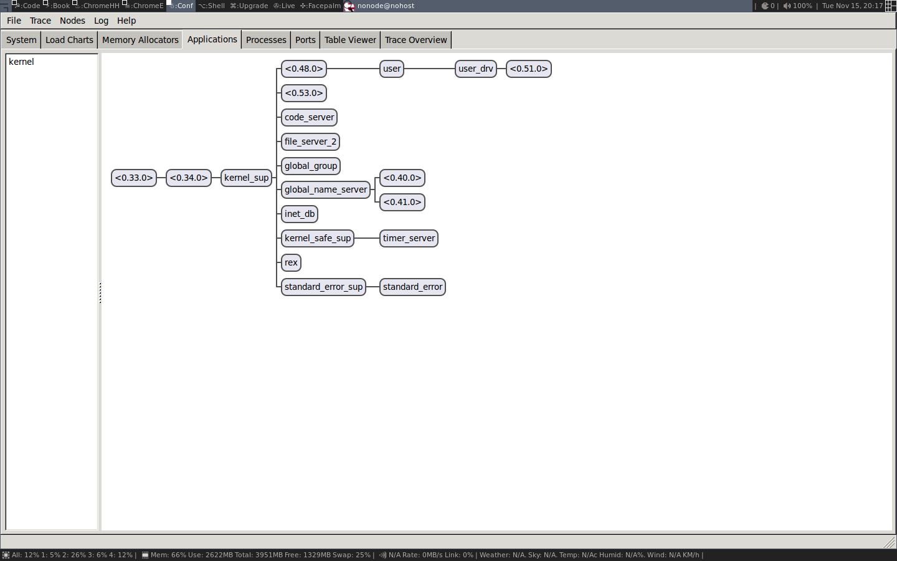

# 3. プロセス

軽量プロセスのコンセプトはErlangとBEAMの本質であり、BEAMを他の仮想マシンから際立たせているものです。BEAM（とErlangとElixir）がどのように動くかを理解するためには、プロセスがどのように動くかを詳しく知っておく必要があります。

BEAM のほぼすべてがプロセスの概念に関連しており、本章ではこれらの関連性をより深く学びます。序章で学んだことを発展させ、メモリ管理、メッセージパッシング、そして特にスケジューリングなどの概念をより深く見ていきます。

ErlangのプロセスはOSのプロセスにとてもよく似ています。独自のアドレス空間を持ち、シグナルやメッセージで他のプロセスと通信でき、プリエンプティブなスケジューラによって実行が制御されます。

ErlangやElixirのシステムでパフォーマンスの問題があるとき、その問題は特定のプロセス内の問題やプロセス間のアンバランスからきていることが多いです。もちろん、悪いアルゴリズムやメモリの問題など、他の章でも見るような一般的な問題もあります。それでも、問題を引き起こしているプロセスをピンポイントで特定できることは常に重要なので、Erlang RunTime Systemでプロセス検査のために利用できるツールについて見ていきます。

この章では、プロセスやスケジューラがどのように機能するかを確認しながら、各ツールを紹介し、最後にすべてのツールをまとめて演習を行います。

## 3.1. プロセスとは何か？

プロセスとは、コードの実行が行われる分離された実体です。プロセスは、エラーの影響を欠陥のあるコードを実行するプロセスに隔離することで、コードのエラーからシステムを保護します。

ランタイムには、ボトルネックや問題点、リソースの使い過ぎを発見するためのプロセスを検査するためのツールが多数付属しています。これらのツールは、問題のあるプロセスを特定し、検査するのに役立ちます。

### 3.1.1. シェルからプロセスをリスト化する

さっそく、実行中のシステムでどのようなプロセスがあるのか見てみましょう。一番簡単な方法はErlangシェルを起動して、`i()`というシェルコマンドを発行することです。Elixirでは`shell_default`モジュールで `:shell_default.i` としてこの関数を呼び出すことができます。

```
$ erl
Erlang/OTP 19 [erts-8.1] [source] [64-bit] [smp:4:4] [async-threads:10]
              [hipe] [kernel-poll:false]

Eshell V8.1  (abort with ^G)
1> i().
Pid                   Initial Call                     Heap     Reds Msgs
Registered            Current Function                 Stack
<0.0.0>               otp_ring0:start/2                 376      579    0
init                  init:loop/1                         2
<0.1.0>               erts_code_purger:start/0          233        4    0
erts_code_purger      erts_code_purger:loop/0             3
<0.4.0>               erlang:apply/2                    987   100084    0
erl_prim_loader       erl_prim_loader:loop/3              5
<0.30.0>              gen_event:init_it/6               610      226    0
error_logger          gen_event:fetch_msg/5               8
<0.31.0>              erlang:apply/2                   1598      416    0
application_controlle gen_server:loop/6                   7
<0.33.0>              application_master:init/4         233       64    0
                      application_master:main_loop/2      6
<0.34.0>              application_master:start_it/4     233       59    0
                      application_master:loop_it/4        5
<0.35.0>              supervisor:kernel/1               610     1767    0
kernel_sup            gen_server:loop/6                   9
<0.36.0>              erlang:apply/2                   6772    73914    0
code_server           code_server:loop/1                  3
<0.38.0>              rpc:init/1                        233       21    0
rex                   gen_server:loop/6                   9
<0.39.0>              global:init/1                     233       44    0
global_name_server    gen_server:loop/6                   9
<0.40.0>              erlang:apply/2                    233       21    0
                      global:loop_the_locker/1            5
<0.41.0>              erlang:apply/2                    233        3    0
                      global:loop_the_registrar/0         2
<0.42.0>              inet_db:init/1                    233      209    0
inet_db               gen_server:loop/6                   9
<0.44.0>              global_group:init/1               233       55    0
global_group          gen_server:loop/6                   9
<0.45.0>              file_server:init/1                233       79    0
file_server_2         gen_server:loop/6                   9
<0.46.0>              supervisor_bridge:standard_error/ 233       34    0
standard_error_sup    gen_server:loop/6                   9
<0.47.0>              erlang:apply/2                    233       10    0
standard_error        standard_error:server_loop/1        2
<0.48.0>              supervisor_bridge:user_sup/1      233       54    0
                      gen_server:loop/6                   9
<0.49.0>              user_drv:server/2                 987     1975    0
user_drv              user_drv:server_loop/6              9
<0.50.0>              group:server/3                    233       40    0
user                  group:server_loop/3                 4
<0.51.0>              group:server/3                    987    12508    0
                      group:server_loop/3                 4
<0.52.0>              erlang:apply/2                   4185     9537    0
                      shell:shell_rep/4                  17
<0.53.0>              kernel_config:init/1              233      255    0
                      gen_server:loop/6                   9
<0.54.0>              supervisor:kernel/1               233       56    0
kernel_safe_sup       gen_server:loop/6                   9
<0.58.0>              erlang:apply/2                   2586    18849    0
                      c:pinfo/1                          50
Total                                                 23426   220863    0
                                                        222
ok
```

`i/0`関数は、システム内の全プロセスのリストをプリントアウトする。各プロセスは2行の情報を得る。プリントアウトの最初の2行は、その情報が何を意味するかを示すヘッダである。見ての通り、プロセス ID (Pid) と、もしあればプロセス名、そしてプロセスが起動して実行中のコードに関する情報を得ることができます。また、ヒープやスタックのサイズ、プロセス内のリダクションやメッセージの数についての情報も得られます。この章の残りの部分では、スタック、ヒープ、リダクション、メッセージとは何かについて詳しく学びます。今のところ、ヒープサイズに大きな数値がある場合、そのプロセスは大量のメモリを使用しており、リダクションに大きな数値がある場合、そのプロセスは大量のコードを実行したと仮定することができます。

`i/3`関数でさらにプロセスを調べることができます。`code_server`プロセスを見てみましょう。私達は、前のリストで、`code_server`のプロセス識別子（pid）が`<0.36.0>`であることを見ることができます。pidの3つの数字で`i/3`を呼び出すことによって、私達はこの情報を得ます。

```
2> i(0,36,0).
[{registered_name,code_server},
 {current_function,{code_server,loop,1}},
 {initial_call,{erlang,apply,2}},
 {status,waiting},
 {message_queue_len,0},
 {messages,[]},
 {links,[<0.35.0>]},
 {dictionary,[]},
 {trap_exit,true},
 {error_handler,error_handler},
 {priority,normal},
 {group_leader,<0.33.0>},
 {total_heap_size,46422},
 {heap_size,46422},
 {stack_size,3},
 {reductions,93418},
 {garbage_collection,[{max_heap_size,#{error_logger => true,
                                       kill => true,
                                       size => 0}},
                      {min_bin_vheap_size,46422},
                      {min_heap_size,233},
                      {fullsweep_after,65535},
                      {minor_gcs,0}]},
 {suspending,[]}]
3>
```

この呼び出しから多くの情報を得ました。この章の残りの部分では、これらの項目のほとんどの意味を詳しく学びます。最初の行は、プロセスに `code_server` という名前が与えられたことを示しています。次に、プロセスが現在実行中または中断している関数 (`current_function`) と、プロセスが実行を開始した関数の名前 (`initial_call`) を見ることができます。

また、プロセスがメッセージ待ちで中断していること (`{status,waiting}`) や、メールボックスにメッセージがないこと (`{message_queue_len,0}, {messages,[]}`) も確認することができます。メッセージ・パッシングがどのように機能するかは、この章の後半で詳しく見ていきます。

`priority`, `suspending`, `reductions`, `links`, `trap_exit`, `error_handler`, `group_leader` フィールドは、プロセスの実行、エラー処理、IOを制御します。`Observer`を導入する際に、もう少し詳しく見ていきます。

最後のいくつかのフィールド (`dictionary`, `total_heap_size`, `heap_size`, `stack_size`, `garbage_collection`) は、プロセスのメモリ使用量に関する情報を提供します。プロセスのメモリ領域については、第12章で詳しく見ていきます。

プロセスに関する情報を得るために、さらに踏み込んだ方法として、`BREAK`メニューから`ctrl+c p [enter]`で得られるプロセス情報を利用する方法があります。`BREAK` 状態にある間はノード全体がフリーズすることに注意してください。

### 3.1.2. プログラムによってプロセスを探索する

シェルの関数はプロセスの情報を表示するだけですが、実際にはこの情報をデータとして取得することができるので、プロセスを検査するための独自のツールを書くことができます。`erlang:processs/0`で全てのプロセスのリストが得られ、`erlang:process_info/1`でプロセスの詳細が得られます。また、関数`whereis/1`で名前からpidが得られます。

```
1> Ps = erlang:processes().
[<0.0.0>,<0.1.0>,<0.4.0>,<0.30.0>,<0.31.0>,<0.33.0>,
 <0.34.0>,<0.35.0>,<0.36.0>,<0.38.0>,<0.39.0>,<0.40.0>,
 <0.41.0>,<0.42.0>,<0.44.0>,<0.45.0>,<0.46.0>,<0.47.0>,
 <0.48.0>,<0.49.0>,<0.50.0>,<0.51.0>,<0.52.0>,<0.53.0>,
 <0.54.0>,<0.60.0>]
2> CodeServerPid = whereis(code_server).
<0.36.0>
3> erlang:process_info(CodeServerPid).
[{registered_name,code_server},
 {current_function,{code_server,loop,1}},
 {initial_call,{erlang,apply,2}},
 {status,waiting},
 {message_queue_len,0},
 {messages,[]},
 {links,[<0.35.0>]},
 {dictionary,[]},
 {trap_exit,true},
 {error_handler,error_handler},
 {priority,normal},
 {group_leader,<0.33.0>},
 {total_heap_size,24503},
 {heap_size,6772},
 {stack_size,3},
 {reductions,74260},
 {garbage_collection,[{max_heap_size,#{error_logger => true,
                                       kill => true,
                                       size => 0}},
                      {min_bin_vheap_size,46422},
                      {min_heap_size,233},
                      {fullsweep_after,65535},
                      {minor_gcs,33}]},
 {suspending,[]}]
 ```

 プロセス情報をデータとして取得することで、データを解析したり、好きなようにソートしたりするコードを書くことができます。もしシステム内の全てのプロセスを取得して（`erlang:processs/0`）、各プロセスのヒープサイズの情報を取得したら（`erlang:process_info(P,total_heap_size)`)、pidとヒープサイズのリストを作って、ヒープサイズでソートすることができます。

 ```
 1> lists:reverse(lists:keysort(2,[{P,element(2,
    erlang:process_info(P,total_heap_size))}
    || P <- erlang:processes()])).
[{<0.36.0>,24503},
 {<0.52.0>,21916},
 {<0.4.0>,12556},
 {<0.58.0>,4184},
 {<0.51.0>,4184},
 {<0.31.0>,3196},
 {<0.49.0>,2586},
 {<0.35.0>,1597},
 {<0.30.0>,986},
 {<0.0.0>,752},
 {<0.33.0>,609},
 {<0.54.0>,233},
 {<0.53.0>,233},
 {<0.50.0>,233},
 {<0.48.0>,233},
 {<0.47.0>,233},
 {<0.46.0>,233},
 {<0.45.0>,233},
 {<0.44.0>,233},
 {<0.42.0>,233},
 {<0.41.0>,233},
 {<0.40.0>,233},
 {<0.39.0>,233},
 {<0.38.0>,233},
 {<0.34.0>,233},
 {<0.1.0>,233}]
2>
```

多くのプロセスのヒープサイズが233であることにお気づきかもしれませんが、これはプロセスのデフォルトの開始ヒープサイズであるためです。

`process_info`で得られる情報の完全な説明については、モジュールerlangのドキュメントを参照してください。`process_info/1` 関数が、プロセスで利用できるすべての情報のサブセットを返すだけであることと、 `process_info/2` 関数が、どのように追加の情報を取得するのに使われるかに注目してください。例として、上記の `code_server` プロセスのバックトレースを抽出するために、次のように実行することができます。

```
3> process_info(whereis(code_server), backtrace).
{backtrace,<<"Program counter: 0x00000000161de900 (code_server:loop/1 + 152)\nCP: 0x0000000000000000 (invalid)\narity = 0\n\n0"...>>}
```

上のバイナリの最後に3つのドットがあるのがわかりますか？これは出力が切り捨てられたことを意味する。全体の値を見るための便利なトリックは、`rp/1`関数を使用して上記の関数呼び出しをラップすることです。

```
4> rp(process_info(whereis(code_server), backtrace)).
```

別の方法として、以下のように`io:put_chars/1`関数を使用することができます。

```
5> {backtrace, Backtrace} = process_info(whereis(code_server), backtrace).
{backtrace,<<"Program counter: 0x00000000161de900 (code_server:loop/1 + 152)\nCP: 0x0000000000000000 (invalid)\narity = 0\n\n0"...>>}
6> io:put_chars(Backtrace).
```

冗長なので、コマンド`4>`と`6>`の出力はここには載せていませんが、ご自由にErlangシェルで上記のコマンドを試してみてください。

### 3.1.3. Observerを使ってプロセスを検査する

プロセスを調べる3つ目の方法はObserverを使うことです。ObserverはErlang RunTime Systemを検査するためのグラフィカルなインターフェースです。この本ではシステムの様々な側面を調べるためにオブザーバを使います。

ObserverはOSのシェルから起動してノードにアタッチするか、ElixirやErlangのシェルから直接起動することができます。今のところ、Elixirシェルからは `:observer.start` で、Erlangシェルからは `:observer.start` でObserver を起動することにします。

```
7> observer:start().
```

Observerを起動すると、次のスクリーンショットを参照し、システムの概要を表示します。


この章と次の章の後で、この情報のいくつかを詳しく説明します。今のところ、Observer を使って実行中のプロセスを見るだけです。まず、実行中のシステムの監視ツリーを表示する`Applications`タブを見ます。



ここでは、各プロセスがどのようにリンクしているかをグラフィカルに表示することができます。これは、システムがどのように構成されているかを概観するのに非常に良い方法です。また、プロセスが空間に浮かぶ孤立した存在であり、リンクによって互いに接続されているという感覚を得ることができます。

実際にプロセスに関する有用な情報を得るために、`Processes` タブに切り替えてみましょう。


この表示では、基本的にシェルの i/0 と同じ情報を得ることができる。pid、登録名、削減数、メモリ使用量、メッセージ数、現在の関数が表示されます。

また、コードサーバーなどの行をダブルクリックすることで、`process_info/2`で得られるような情報を得ることができ、プロセスを調べることができます。


これらの情報が何を意味するのか、今すぐには説明しませんが、読み進めていただければ、いずれすべてが明らかになります。

```
Observerを有効にする
もしあなたがerlang.mkやrebarでアプリケーションをビルドしていて、Observerアプリケーションをビルドに含めたいなら、 yourapp.app.src でアプリケーションのリストに runtime_tools, wx, observer を追加する必要があるかもしれません。
```

さて、プロセスとは何かという基本的な理解と、システム内のプロセスを発見し検査するためのツールを手に入れたので、次はプロセスがどのように実装されるかを深く掘り下げて学んでいくことにします。

## 3.2. プロセスはただのメモリ

プロセスは基本的に、スタック、ヒープ、メッセージエリア、プロセスコントロールブロック（PCB）という4つのメモリブロックから構成されています。

スタックは、戻り値を格納することでプログラムの実行を追跡したり、関数に引数を渡したり、ローカル変数を保持したりするために使用されます。リストやタプルのような大きな構造はヒープに格納されます。

メッセージ領域はメールボックスとも呼ばれ、他のプロセスからプロセスに送信されたメッセージを格納するために使用されます。プロセス制御ブロックは、プロセスの状態を把握するために使用されます。

メモリとしてのプロセスのイメージは下図を参照してください。

Figure 7. Erlang Process Memory : Basic

このプロセス図は非常に単純化されたものであり、より正確な図を得るために、より洗練されたバージョンを何度も繰り返すことになります。

スタック、ヒープ、メールボックスはすべて動的に割り当てられ、必要に応じて大きくしたり小さくしたりすることができます。これがどのように機能するかは、後の章で詳しく説明します。一方 PCB は静的に割り当てられ、プロセスを制御するいくつかのフィールドを含んでいます。

HiPEのイントロスペクション用組み込み関数（HiPE BIFs）を使用することで、実際にこれらのメモリ領域のいくつかを検査することができます。これらの BIF を使って、スタック、ヒープ、PCB のメモリ内容をプリントアウトすることができます。生データが印刷され、ほとんどの場合、データと共に人間が読めるバージョンも印刷されます。メモリを検査したときに見えるもの全てを本当に理解するには、Erlangのタグ付けスキーム（第4章で説明します）と実行モデルとエラー処理（第5章で説明します）についてもっと知る必要がありますが、これらのツールを使うことで、プロセスが本当にメモリだけなのかよく見えるようになります。

```
HiPE’s Built In Functions (HiPE BIFs)

HiPE BIFはErlang/OTPの正式な一部ではありません。OTPチームもサポートしていません。HiPE BIFはいつでも削除されたり変更されたりする可能性がありますので、ミッションクリティカルなサービスをHiPE BIFに基づかせないでください。

これらのBIFは、安全とは言えないかもしれない方法でERTSの内部を調べます。イントロスペクションのためのBIFは、しばしば標準出力にプリントするだけで、その出力の行き着く先には驚くかもしれません。

これらのBIFは、リダクションを使用せずにスケジューラスレッドを長時間ロックすることができます（それが何を意味するかは次の章で見ていきます）。例えば、非常に大きなプロセスのヒープをプリントすると、長い時間がかかることがあります。

これらのBIFは、デバッグにのみ使用されることを意図しており、ご自身の責任で使用してください。実稼働しているシステムで実行することは、おそらく避けるべきでしょう。

HiPE BIFの多くは著者が90年代半ば（64ビットErlangが存在する前）に書いたもので、64ビットマシンでのプリントアウトは少しずれているかもしれません。この本が印刷される頃にはERTSに含まれていることを期待しています。そうでなければ、コードセクションで提供されるパッチと付録Aの説明書を使って、あなた自身のバージョンを構築することができます。
```

`hipe_bifs:show_estack/1`でプロセスのスタックのコンテキストを見ることができます。

```
1> hipe_bifs:show_estack(self()).
 |                BEAM  STACK              |
 |            Address |           Contents |
 |--------------------|--------------------| BEAM ACTIVATION RECORD
 | 0x00007f9cc3238310 | 0x00007f9cc2ea6fe8 | BEAM PC shell:exprs/7 + 0x4e
 | 0x00007f9cc3238318 | 0xfffffffffffffffb | []
 | 0x00007f9cc3238320 | 0x000000000000644b | none
 |--------------------|--------------------| BEAM ACTIVATION RECORD
 | 0x00007f9cc3238328 | 0x00007f9cc2ea6708 | BEAM PC shell:eval_exprs/7 + 0xf
 | 0x00007f9cc3238330 | 0xfffffffffffffffb | []
 | 0x00007f9cc3238338 | 0xfffffffffffffffb | []
 | 0x00007f9cc3238340 | 0x000000000004f3cb | cmd
 | 0x00007f9cc3238348 | 0xfffffffffffffffb | []
 | 0x00007f9cc3238350 | 0x00007f9cc3237102 | {value,#Fun<shell.5.104321512>}
 | 0x00007f9cc3238358 | 0x00007f9cc323711a | {eval,#Fun<shell.21.104321512>}
 | 0x00007f9cc3238360 | 0x00000000000200ff | 8207
 | 0x00007f9cc3238368 | 0xfffffffffffffffb | []
 | 0x00007f9cc3238370 | 0xfffffffffffffffb | []
 | 0x00007f9cc3238378 | 0xfffffffffffffffb | []
 |--------------------|--------------------| BEAM ACTIVATION RECORD
 | 0x00007f9cc3238380 | 0x00007f9cc2ea6300 | BEAM PC shell:eval_loop/3 + 0x47
 | 0x00007f9cc3238388 | 0xfffffffffffffffb | []
 | 0x00007f9cc3238390 | 0xfffffffffffffffb | []
 | 0x00007f9cc3238398 | 0xfffffffffffffffb | []
 | 0x00007f9cc32383a0 | 0xfffffffffffffffb | []
 | 0x00007f9cc32383a8 | 0x000001a000000343 | <0.52.0>
 |....................|....................| BEAM CATCH FRAME
 | 0x00007f9cc32383b0 | 0x0000000000005a9b | CATCH 0x00007f9cc2ea67d8
 |                    |                    |  (BEAM shell:eval_exprs/7 + 0x29)
 |********************|********************|
 |--------------------|--------------------| BEAM ACTIVATION RECORD
 | 0x00007f9cc32383b8 | 0x000000000093aeb8 | BEAM PC normal-process-exit
 | 0x00007f9cc32383c0 | 0x00000000000200ff | 8207
 | 0x00007f9cc32383c8 | 0x000001a000000343 | <0.52.0>
 |--------------------|--------------------|
true
2>
```

第4章では、スタックとヒープ上の値を詳しく見ていきます。ヒープの内容は `hipe_bifs:show_heap/1` によって表示されます。ここでは大きなヒープを表示したくないので、何もしない新しいプロセスを生成してそのヒープを表示することにします。

```
2> hipe_bifs:show_heap(spawn(fun () -> ok end)).
From: 0x00007f7f33ec9588 to 0x00007f7f33ec9848
 |                 H E A P                 |
 |            Address |           Contents |
 |--------------------|--------------------|
 | 0x00007f7f33ec9588 | 0x00007f7f33ec959a | #Fun<erl_eval.20.52032458>
 | 0x00007f7f33ec9590 | 0x00007f7f33ec9839 | [[]]
 | 0x00007f7f33ec9598 | 0x0000000000000154 | Thing Arity(5) Tag(20)
 | 0x00007f7f33ec95a0 | 0x00007f7f3d3833d0 | THING
 | 0x00007f7f33ec95a8 | 0x0000000000000000 | THING
 | 0x00007f7f33ec95b0 | 0x0000000000600324 | THING
 | 0x00007f7f33ec95b8 | 0x0000000000000000 | THING
 | 0x00007f7f33ec95c0 | 0x0000000000000001 | THING
 | 0x00007f7f33ec95c8 | 0x000001d0000003a3 | <0.58.0>
 | 0x00007f7f33ec95d0 | 0x00007f7f33ec95da | {[],{eval...
 | 0x00007f7f33ec95d8 | 0x0000000000000100 | Arity(4)
 | 0x00007f7f33ec95e0 | 0xfffffffffffffffb | []
 | 0x00007f7f33ec95e8 | 0x00007f7f33ec9602 | {eval,#Fun<shell.21.104321512>}
 | 0x00007f7f33ec95f0 | 0x00007f7f33ec961a | {value,#Fun<shell.5.104321512>}...
 | 0x00007f7f33ec95f8 | 0x00007f7f33ec9631 | [{clause...

 ...

 | 0x00007f7f33ec97d0 | 0x00007f7f33ec97fa | #Fun<shell.5.104321512>
 | 0x00007f7f33ec97d8 | 0x00000000000000c0 | Arity(3)
 | 0x00007f7f33ec97e0 | 0x0000000000000e4b | atom
 | 0x00007f7f33ec97e8 | 0x000000000000001f | 1
 | 0x00007f7f33ec97f0 | 0x0000000000006d0b | ok
 | 0x00007f7f33ec97f8 | 0x0000000000000154 | Thing Arity(5) Tag(20)
 | 0x00007f7f33ec9800 | 0x00007f7f33bde0c8 | THING
 | 0x00007f7f33ec9808 | 0x00007f7f33ec9780 | THING
 | 0x00007f7f33ec9810 | 0x000000000060030c | THING
 | 0x00007f7f33ec9818 | 0x0000000000000002 | THING
 | 0x00007f7f33ec9820 | 0x0000000000000001 | THING
 | 0x00007f7f33ec9828 | 0x000001d0000003a3 | <0.58.0>
 | 0x00007f7f33ec9830 | 0x000001a000000343 | <0.52.0>
 | 0x00007f7f33ec9838 | 0xfffffffffffffffb | []
 | 0x00007f7f33ec9840 | 0xfffffffffffffffb | []
 |--------------------|--------------------|
true
3>
```

`hipe_bifs:show_pcb/1` を使用して PCB のいくつかのフィールドの内容を表示することもできます。

```
3> hipe_bifs:show_pcb(self()).
 P: 0x00007f7f3cbc0400
 ---------------------------------------------------------------
 Offset| Name        | Value              | *Value             |
     0 | id          | 0x000001d0000003a3 |                    |
    72 | htop        | 0x00007f7f33f15298 |                    |
    96 | hend        | 0x00007f7f33f16540 |                    |
    88 | heap        | 0x00007f7f33f11470 |                    |
   104 | heap_sz     | 0x0000000000000a1a |                    |
    80 | stop        | 0x00007f7f33f16480 |                    |
   592 | gen_gcs     | 0x0000000000000012 |                    |
   594 | max_gen_gcs | 0x000000000000ffff |                    |
   552 | high_water  | 0x00007f7f33f11c50 |                    |
   560 | old_hend    | 0x00007f7f33e90648 |                    |
   568 | old_htop    | 0x00007f7f33e8f8e8 |                    |
   576 | old_head    | 0x00007f7f33e8e770 |                    |
   112 | min_heap_.. | 0x00000000000000e9 |                    |
   328 | rcount      | 0x0000000000000000 |                    |
   336 | reds        | 0x0000000000002270 |                    |
    16 | tracer      | 0xfffffffffffffffb |                    |
    24 | trace_fla.. | 0x0000000000000000 |                    |
   344 | group_lea.. | 0x0000019800000333 |                    |
   352 | flags       | 0x0000000000002000 |                    |
   360 | fvalue      | 0xfffffffffffffffb |                    |
   368 | freason     | 0x0000000000000000 |                    |
   320 | fcalls      | 0x00000000000005a2 |                    |
   384 | next        | 0x0000000000000000 |                    |
    48 | reg         | 0x0000000000000000 |                    |
    56 | nlinks      | 0x00007f7f3cbc0750 |                    |
   616 | mbuf        | 0x0000000000000000 |                    |
   640 | mbuf_sz     | 0x0000000000000000 |                    |
   464 | dictionary  | 0x0000000000000000 |                    |
   472 | seq..clock  | 0x0000000000000000 |                    |
   480 | seq..astcnt | 0x0000000000000000 |                    |
   488 | seq..token  | 0xfffffffffffffffb |                    |
   496 | intial[0]   | 0x000000000000320b |                    |
   504 | intial[1]   | 0x0000000000000c8b |                    |
   512 | intial[2]   | 0x0000000000000002 |                    |
   520 | current     | 0x00007f7f3be87c20 | 0x000000000000ed8b |
   296 | cp          | 0x00007f7f3d3a5100 | 0x0000000000440848 |
   304 | i           | 0x00007f7f3be87c38 | 0x000000000044353a |
   312 | catches     | 0x0000000000000001 |                    |
   224 | arity       | 0x0000000000000000 |                    |
   232 | arg_reg     | 0x00007f7f3cbc04f8 | 0x000000000000320b |
   240 | max_arg_reg | 0x0000000000000006 |                    |
   248 | def..reg[0] | 0x000000000000320b |                    |
   256 | def..reg[1] | 0x0000000000000c8b |                    |
   264 | def..reg[2] | 0x00007f7f33ec9589 |                    |
   272 | def..reg[3] | 0x0000000000000000 |                    |
   280 | def..reg[4] | 0x0000000000000000 |                    |
   288 | def..reg[5] | 0x00000000000007d0 |                    |
   136 | nsp         | 0x0000000000000000 |                    |
   144 | nstack      | 0x0000000000000000 |                    |
   152 | nstend      | 0x0000000000000000 |                    |
   160 | ncallee     | 0x0000000000000000 |                    |
    56 | ncsp        | 0x0000000000000000 |                    |
    64 | narity      | 0x0000000000000000 |                    |
 ---------------------------------------------------------------

true
4>
```

これらの検査ツールを駆使して、PCBのフィールドが何を意味するのかを見ていこう。

## 3.3. PCB

プロセス制御ブロックには、プロセスの動作や現在の状態を制御するすべてのフィールドが含まれています。この章と残りの章では、最も重要なフィールドについて見ていきます。この章では、実行やトレースに関係するいくつかのフィールドは割愛し、代わりに第5章で取り上げることにします。

この章で行くよりさらに深く掘り下げたい場合、C ソースコードを見ることができます。PCB は `erl_process.h` で process と呼ばれる C 言語の構造体として実装されています。

idフィールドには、プロセスID（またはPID）が含まれる。

```
    0 | id          | 0x000001d0000003a3 |                    |
```

プロセスIDはErlangの用語で、それゆえタグが付けられています（4章参照）。これは最下位4ビットがタグ(0011)であることを意味します。コードセクションにはErlangの用語を検査するモジュール(`show.erl`参照)がありますが、これは型の章で説明します。しかし今はタグ付けされた単語の型を調べるのに使うことができます。

```
4> show:tag_to_type(16#0000001d0000003a3).
pid
5>
```

フィールド`htop`と`stop`はヒープとスタックの先頭へのポインタであり、ヒープまたはスタック上の次の空きスロットを指している。フィールド `heap` (`start`) と `hend` はヒープ全体のスタートとストップを指し、`heap_sz` はヒープのサイズをワード数で表します。つまり、64ビットマシンでは`hend - heap = heap_sz * 8`、32ビットマシンでは`hend - heap = heap_sz * 4`となります。

`min_heap_size`フィールドは、ヒープが開始され、それ以下に縮小されないサイズ（単語単位）であり、デフォルト値は233である。

ヒープの形状を制御する PCB からのフィールドを使用して、プロセスヒープの画像を洗練させることができます。

Figure 8. Erlang Process Heap

しかし待ってください、なぜヒープの開始と終了があるのに、スタックの開始と終了がないのでしょう？それは、BEAM がヒープとスタックを一緒に割り当てることで、空間とポインタを節約するトリックを使 っているからです。ここで、メモリとしてのプロセスの図式を初めて修正することにします。ヒープとスタックは、実際には 1 つのメモリ領域です。

Figure 9. Erlang Process Memory : Heap + Stack

スタックはより低いメモリアドレスに向かって、ヒープはより高いメモリに向かって成長するので、スタックのトップポインタを絵に加えることによって、ヒープの絵を洗練させることもできるのです。

Figure 10. Erlang Process Heap and Stack

もし、`htop`と`stop`のポインタが出会ったら、プロセスは空きメモリがなくなり、メモリを解放するためにガベージコレクションをしなければならなくなります。

## 3.4. ガベージコレクタ（GC）

ヒープメモリ管理のスキーマは、プロセスごとにコピーする世代別ガベージコレクタを使用することです。ヒープ（またはスタック、これらは割り当てられたメモリブロックを共有しているため）に空き領域がなくなると、ガベージコレクタはメモリを解放するために動作します。

GC は `to space` と呼ばれる新しいメモリ領域を割り当てます。そして、スタックを調べてすべての生きているルートを見つけ、それぞれのルートをたどって、ヒープ上のデータを新しいヒープにコピーします。最後に、スタックも新しいヒープにコピーし、古いメモリ領域を解放します。

GCはPCB内のこれらのフィールドで制御されます。

```
    Eterm *high_water;
    Eterm *old_hend;    /* Heap pointers for generational GC. */
    Eterm *old_htop;
    Eterm *old_heap;
    Uint max_heap_size; /* Maximum size of heap (in words). */
    Uint16 gen_gcs;	/* Number of (minor) generational GCs. */
    Uint16 max_gen_gcs;	/* Max minor gen GCs before fullsweep. */
```

ガベージコレクタは生成的なので、ほとんどの場合、新しいデータだけを見るというヒューリスティックを使用します。つまり、 `minor collection`と呼ばれるもので、GCはスタックの一番上の部分だけを見て、新しいデータを新しいヒープに移動させます。古いデータ、つまりヒープ上の `high_water mark`（下図参照）より下に割り当てられたデータは、古いヒープと呼ばれる特別な領域に移動されます。

PCB のフィールド `old_heap`, `old_htop`, `old_hend` で処理される古いヒープです。これは、4つのメモリ領域としてのプロセスの元の図にほぼ戻ります。

Figure 11. Erlang Process Memory : GC

プロセス開始時には古いヒープはありませんが、若いデータが古いデータに成熟し、ガベージコレクションがあるとすぐに古いヒープが確保されます。古いヒープは、`full sweep`とも呼ばれる`major collection`が行われるときに、ガベージコレクションされます。ガベージコレクションの仕組みの詳細については、第12章を参照してください。その章では、メモリ関連の問題を追跡して修正する方法についても見ていきます。

## 3.5. メールボックスとメッセージパッシング

プロセス通信はメッセージパッシングによって行われる。プロセス送信は、送信プロセスが自分のヒープから受信プロセスのメールボックスにメッ セージをコピーするように実装されています。

Erlangの初期のころはスケジューラのマルチタスクで並行処理が実装されていました。同時実行性についてはこの章の後のスケジューラのセクションで詳しく説明しますが、Erlangの最初のバージョンでは並列処理はなく、一度に1つのプロセスしか実行できなかったことは覚えておいてください。そのバージョンでは送信プロセスは受信プロセスのヒープに直接データを書き込むことができました。

### 3.5.1. メッセージの並列送信

マルチコアシステムが導入され、Erlangの実装が複数のスケジューラでプロセスを並行して実行するようになったとき、受信者のメインロックを取らずに他のプロセスのヒープに直接書き込むことはもはや安全ではなくなりました。このとき、`m-buf`という概念が導入されました（ヒープフラグメントとも呼ばれます）。`m-buf`とは、プロセスヒープの外側にある、他のプロセスが安全にデータを書き込めるメモリ領域のことである。送信側のプロセスがロックを取得できない場合、代わりに`m-buf`に書き込むことになります。メッセージのすべてのデータが `m-buf` にコピーされると、メッセージはメールボックスを通じてプロセスにリンクされます。リンク (`erl_message.h` の `LINK_MESSAGE`) は、受信側のメッセージ・キューにメッセージを追加します。

その後、ガベージコレクタがメッセージをプロセスのヒープにコピーします。GCの圧力を減らすために、メールボックスは2つのリストに分けられ、1つは見たメッセージを含み、もう1つは新しいメッセージを含みます。GCは新しいメッセージを見る必要はありません。なぜなら、それらが生き残ることが分かっているからです（それらはまだメールボックスにあります）。そして、この方法でいくつかのコピーを避けることができます。

